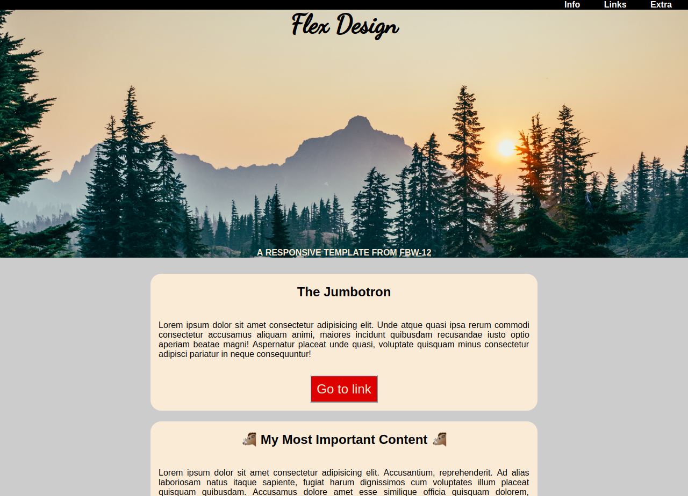
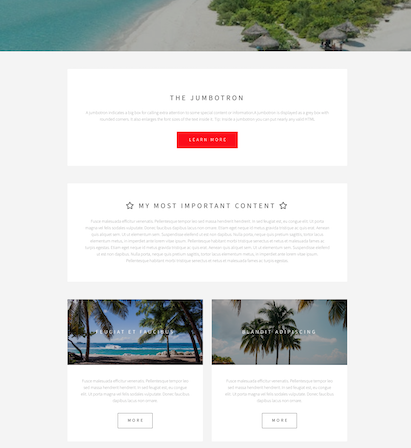

# Responsive template

This website was created by Stefan Klinkusch at Digital Career Institute in Berlin, Germany. 

## Techniques

- semantic HTML
- usage of normalize.css
- usage of fontawesome
- usage of Google webfonts
- CSS3
  - usage of different units (_not only_ % and px, but _also_ em, rem, vh, vw)
  - pseudo-classes (:active, :first-of-type, :first-child, :hover, :last-child, :last-of-type, :visited)
  - pseudo-elements (::after, ::before)
  - flexbox
  - css-variables
  - border-radius
  - media queries

## Screenshot


	

## Task
You will create a responsive layout using HTML and CSS

### Topics
***HTML:*** HTML5 Semantic Elements  
***CSS:***  flexbox, variables, units, border-radius, pseudo-element, pseudo-classes, media queries, google-fonts, font-awesome, normalize,


### You should use

- header and footer
- a navigation menu
- a jumbotron
- sections and articles
- responsive design
- google fonts
- font awesome icons


### Design

  

Check the mockups for details:


- [Mobile](./assets/images/mobile.png)  
- [Desktop](./assets/images/desktop.png)  


### Bonus

Picture from Unsplash.com & Placeholder.it  
Fonts are ```Pacifico|Source+Sans+Pro:200,400``` from Google Fonts


Image hover effect is ```transform: scale(1.1);```
